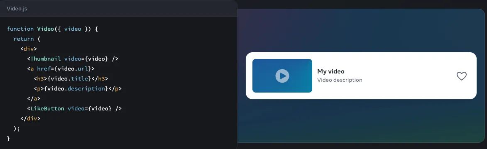
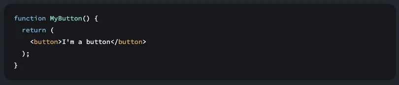
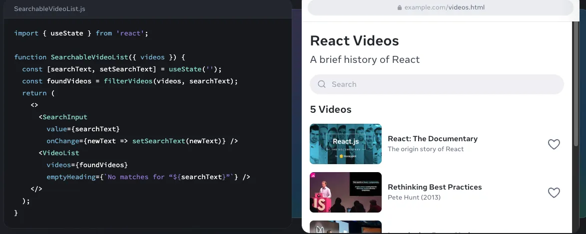
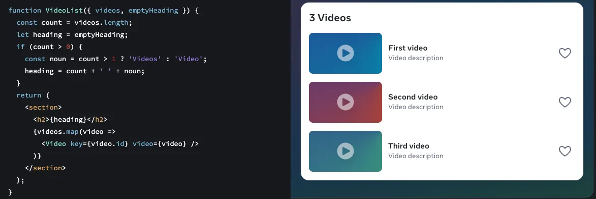

* React
  * := **Library** for UIs web & native mobile
    * != framework
    * native mobile
      * -- via -- [React Native](https://reactnative.dev/)
    * -> 
      * ⚠️does NOT indicate how to ⚠️
        * route
        * fetch data
      * ⚠️ If you want to build an entire full-stack React application, you can use a framework ⚠️
        * [Next.js](https://nextjs.org/)
        * [Remix](https://remix.run/)

* React Components
  * := 👀 individual pieces ([button, entire page]) 👀 (=== | 1! file) / OWN
    * logic
    * appearance
  * _Example:_ `Thumbnail`, `LikeButton` & `Video`
   
    
  
  * from components → create UI
    * ⚠️ SEVERAL can be combined perfectly ⚠️
  * `export default FunctionName {…}`
    * ⚠️specify the **MAIN component** | file ⚠️
  * 👀== JS functions / return markup 👀
  * JSX === JS functions + markup
    * markup
      * Reason: 🧠 ≠ HTML 🧠
    * ⚠️MOST used way to write React components ⚠️
      * JSX != React
    * .js
    * `CapitalLetter…`
      * naming convention
        * ≠ [HTML tags](https://www.w3schools.com/TAGS/default.asp)
    * 👀make easier about components 👀
      * create
      * maintain
      * delete
    * JS functions /
      * has arguments
      * return markup
      
        
      * [ReactiveX approach](https://reactivex.io/)
        * == listen-react -- to -- certain events
        
        
      * accepts conditionals, loops ...
        * _Example:_ `if`, `map()`, …

        

* ways to use React?
  * | your whole page
  * | concrete HTML page (!= whole website) 