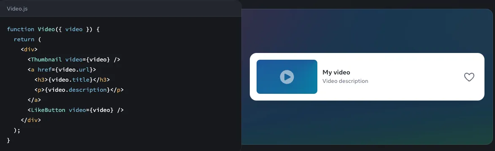
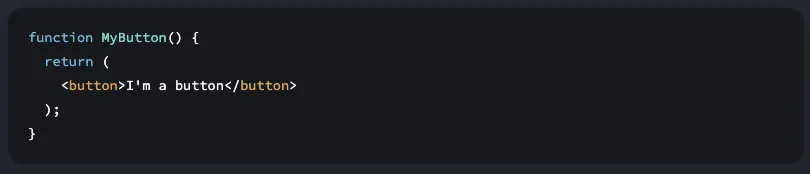
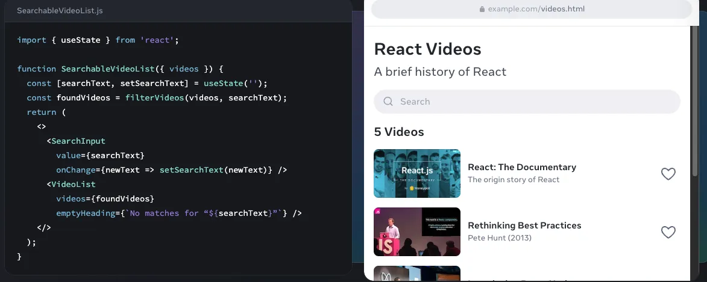
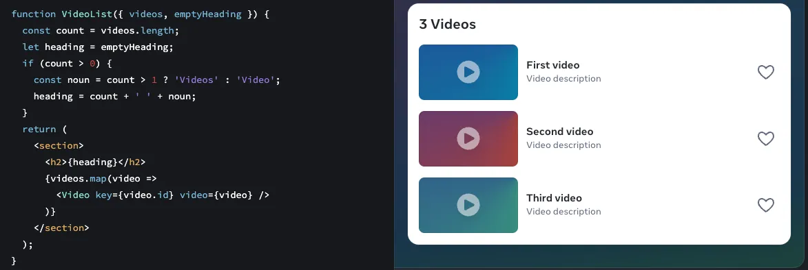

* React
  * := JS Library -- for -- building UIs web & native mobile
    * != framework
    * native mobile
      * -- via -- [React Native](https://reactnative.dev/)
    * -> 
      * ⚠️does NOT indicate how to ⚠️
        * route
        * fetch data
      * ⚠️if you want to build an entire FULL-stack React application, you can use a framework ⚠️
        * [Next.js](https://nextjs.org/)
        * [Remix](https://remix.run/)
    * is
      * [Declarative](learn/reacting-to-input-with-state.md)
      * **Component-Based:** 
        * TODO: Build encapsulated components that manage their own state, then compose them to make complex UIs
        * Since component logic is written in JavaScript instead of templates, you can easily pass rich data through your app and keep the state out of the DOM.
      * **Learn Once, Write Anywhere:**
        * [can render -- , thanks to Node, -- | server](reference/react-dom/server) 
        * cross-platform
          * web
          * mobile -- thanks to -- [React Native](https://reactnative.dev/)

* React Components
  * := 👀 individual pieces ([button, entire page]) 👀 (=== | 1! file) / OWN
    * logic
    * appearance
  * _Example:_ `Thumbnail`, `LikeButton` & `Video`
   
    
  
  * from components → create UI
    * ⚠️ SEVERAL can be combined perfectly ⚠️
  * `export default FunctionName {…}`
    * ⚠️specify the MAIN  REACT component | file ⚠️
  * 👀== JS functions / return markup 👀
  * JSX === JS functions + markup
    * markup
      * Reason: 🧠 ≠ HTML 🧠
    * ⚠️MOST used (BUT NOT MANDATORY) way to write React components ⚠️
      * JSX != React
    * .js
    * vs HTML
      * stricter
    * `CapitalLetter…`
      * ⚠️naming convention, MANDATORY ⚠️
        * ≠ [HTML tags](https://www.w3schools.com/TAGS/default.asp)
    * 👀make easier about components 👀
      * create
      * maintain
      * delete
    * JS functions /
      * has arguments
      * return markup
      
        
      * [ReactiveX approach](https://reactivex.io/)
        * == listen-react -- to -- certain events
        
        
      * accepts conditionals, loops ...
        * _Example:_ `if`, `map()`, …

        

* ways to use React?
  * | your whole page
  * | concrete HTML page (!= whole website) 