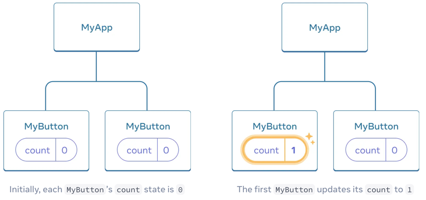
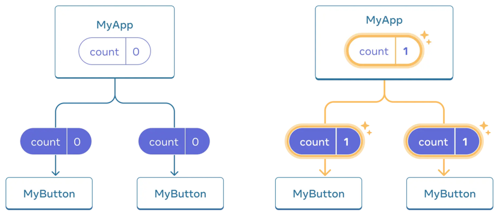

## Creating and nesting components {/*components*/}

* React apps
  * == *React components*

* React components -- can be nested into -- ANOTHER React components
  * _Example:_

  ```js
  function MyButton() {
    return (
      <button>I'm a button</button>
    );
  }
  
  export default function MyApp() {
    return (
            <div>
              <h1>Welcome to my app</h1>
              <MyButton />    <!-- NESTED here. Identified as React Component because starts by a capital letter -->
            </div>
    );
  }
  ```

## Writing markup -- thanks to -- JSX {/*writing-markup-with-jsx*/}

* supported by 
  * [ALL tools / recommended for local development](/learn/installation)

* `<ReactComponent />`
  * way to close tags

* 👀return 1! JSX tag / React component 👀
  * if you want to return SEVERAL -> wrap them into a shared parent (_Example:_ `<div>...</div>` or `<>...</>`)
    * _Example:_ 

  ```js {3,6}
  function AboutPage() {
    return (
      <>
        <h1>About</h1>
        <p>Hello there.<br />How do you do?</p>
      </>
    );
  }
  ```

* [online converter from HTML -- to -- JSX](https://transform.tools/html-to-jsx)

## Adding styles {/*adding-styles*/}

* == | HTML
  * _Example:_ specify a CSS class -- via -- `className`

    ```js
    
    ```

    ```css
    /* In your CSS */
    .avatar {
      border-radius: 50%;
    }
    ```

* add CSS files
  * NOT specified by React
  * if you use a build tool or a framework -> consult its documentation

## Displaying data {/*displaying-data*/}

* `{ variableName or expression }`
  * allows
    * "escape back" | JS
  * _Example:_ 

    ```js {3}
    return (
      <h1>
        {user.name}
      </h1>
    );
    ```

    ```js {3,4}
    return (
      
    );
    ```

* see [string concatenation](https://javascript.info/operators#string-concatenation-with-binary)

* != `{{ ... }}` for objects | `style={ }`
  * _Example:_ 

  ```js
  export default function Profile() {
    return (
      <>
        <h1>{user.name}</h1>
        
      </>
    );
  }
  ```

  ```css
  .avatar {
    border-radius: 50%;
  }
  
  .large {
    border: 4px solid gold;
  }
  ```

## Conditional rendering {/*conditional-rendering*/}

* == conditional rendering | JS code
  * _Example1:_ [`if`](https://developer.mozilla.org/en-US/docs/Web/JavaScript/Reference/Statements/if...else)

    ```js
    let content;
    if (isLoggedIn) {
      content = <AdminPanel />;
    } else {
      content = <LoginForm />;
    }
    return (
      <div>
        {content}
      </div>
    );
    ```

  * _Example2:_ [conditional `?` operator.](https://developer.mozilla.org/en-US/docs/Web/JavaScript/Reference/Operators/Conditional_Operator)

    ```js
    <div>
      {isLoggedIn ? (
        <AdminPanel />
      ) : (
        <LoginForm />
      )}
    </div>
    ```

  * _Example3:_ if you do NOT need the `else` branch -> use a shorter [logical `&&` syntax](https://developer.mozilla.org/en-US/docs/Web/JavaScript/Reference/Operators/Logical_AND#short-circuit_evaluation)

    ```js
    <div>
      {isLoggedIn && <AdminPanel />}
    </div>
    ```

## Rendering lists {/*rendering-lists*/}

* use JS features
  * [`for` loop](https://developer.mozilla.org/en-US/docs/Web/JavaScript/Reference/Statements/for)
  * [array `map()` function](https://developer.mozilla.org/en-US/docs/Web/JavaScript/Reference/Global_Objects/Array/map)

* _Example:_ let's have an array of products

```js
const products = [
  { title: 'Cabbage', id: 1 },
  { title: 'Garlic', id: 2 },
  { title: 'Apple', id: 3 },
];

// `map()` to transform an array of products -- into an -- array of `<li>` items
const listItems = products.map(product =>
        <li key={product.id}>   <!-- key    ==    React key feature --> 
          {product.title}
        </li>
);

return (
        <ul>{listItems}</ul>
);
```

## Responding to events {/*responding-to-events*/}

* declaration | your components
* `... event={eventHandlerFunction}`
  * use it
  * wrapped under `{}` -- to display -- data
  * != `... eventHandlerFunction()}`
    * Reason: 🧠NOT invoke it 🧠

* _Example:_  

    ```js {2-4,7}
    function MyButton() {
      // declare event handler | React component
      function handleClick() {
        alert('You clicked me!');
      }
  
      return (
        <button onClick={handleClick}>
          Click me
        </button>
      );
    }
    ```

## Updating the screen {/*updating-the-screen*/}

* [`useState`](/reference/react/useState)
  * allows
    * React component
      * "remember" information
      * display information
  * return `[something, setSomething]`
    * `something` == current state
    * `setSomething` == function -- to -- update it
  * _Example1:_ count # of times / button is clicked 

    ```js
    import { useState } from 'react';
    
    function MyButton() {
      // declare a state variable | your component
      const [count, setCount] = useState(0);    
      // count        == current state  / by default it's 0   
      // setCount     == function to update it
      // ...
    
      function handleClick() {
        setCount(count + 1);    // update the state   -> React will call your component function again
      }

      return (
        <button onClick={handleClick}>
          Clicked {count} times
        </button>
    };
    ```

  * _Example2:_ render the SAME component multiple times / each has its own state

    ```js
    import { useState } from 'react';
    
    export default function MyApp() {
      return (
        <div>
          <h1>Counters that update separately</h1>
          <MyButton />
          <MyButton />
        </div>
      );
    }
    
    function MyButton() {
      const [count, setCount] = useState(0);
    
      function handleClick() {
        setCount(count + 1);
      }
    
      return (
        <button onClick={handleClick}>
          Clicked {count} times
        </button>
      );
    }
    ```

    ```css
    button {
      display: block;
      margin-bottom: 5px;
    }
    ```
    
    

## Using Hooks {/*using-hooks*/}

* := functions / named by `use…`
  * allow
    * using different React features from your React components
  * restrictions
    * ⚠️ONLY been called | top of ⚠️
      * components
      * other hooks
* uses
  * if DIFFERENT to PREVIOUS restriction -> extract | NEW component
* types
  * built-in
    * `useState`
  * your own ones
* see [API reference.](/reference/react)

## Sharing data between components {/*sharing-data-between-components*/}

* steps
  * create nest components
  * use props
    * 👀:= state | top level of parent component -- is passed to -- EACH child 👀
* "lifting state up"
  * == shared it between components -> move state up
* _Example:_ PREVIOUS app / MULTIPLE buttons & change the counter in BOTH
 
  

  * click on the button -> `onClick` handler fires 
  * EACH button's `onClick` prop -- is set to the -- `handleClick` function | `MyApp`
    * `setCount(count + 1)` == increment the `count` state variable -> NEW `count` value -- is passed as a prop to -- EACH button == ALL show the NEW value 

  ```js
  import { useState } from 'react';
  
  export default function MyApp() {
    // state -- is moved to the -- parent
    const [count, setCount] = useState(0);
  
    function handleClick() {
      setCount(count + 1);
    }
  
    return (
      <div>
        <h1>Counters that update together</h1>
        <MyButton count={count} onClick={handleClick} />    <!-- {variableToDisplay} -->
        <MyButton count={count} onClick={handleClick} />
      </div>
    );
  }
  
  function MyButton({ count, onClick }) {
    return (
      <button onClick={onClick}>
        Clicked {count} times
      </button>
    );
  }
  ```

  ```css
  button {
    display: block;
    margin-bottom: 5px;
  }
  ```
