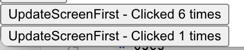

## Creating and nesting components {/*components*/}

* React apps
  * == *React components*

* React components -- can be nested into -- ANOTHER React components
  * _Example:_ [MyApp](/samples/getStarted/quick-start)

## Writing markup -- thanks to -- JSX {/*writing-markup-with-jsx*/}

* supported by 
  * [ALL tools / recommended for local development](installation.md)

* `<ReactComponent />`
  * way to close tags

* 👀return 1! JSX tag / React component 👀
  * if you want to return SEVERAL -> wrap them into a shared parent (_Example:_ `
...
` or `<>...</>`)
    * _Example:_ [`AboutPage`](/samples/getStarted/quick-start)

* [online converter from HTML -- to -- JSX](https://transform.tools/html-to-jsx)

## Adding styles {/*adding-styles*/}

* == | HTML
  * -- via -- `className`
  * _Example:_ [`<AddStyles />`](/samples/getStarted/quick-start)

* add CSS files
  * NOT specified by React
  * if you use a build tool or a framework -> consult its documentation

## Displaying data {/*displaying-data*/}

* `{ variableName or expression }`
  * allows
    * "escape back" | JS
  * != `{{ ... }}` for objects | `style={ }`
  * _Example:_ [`<DisplayData />`](/samples/getStarted/quick-start) 

* see [string concatenation](https://javascript.info/operators#string-concatenation-with-binary)

## Conditional rendering {/*conditional-rendering*/}

* == conditional rendering | JS code
  * [`if`](https://developer.mozilla.org/en-US/docs/Web/JavaScript/Reference/Statements/if...else)
  * [conditional `?` operator.](https://developer.mozilla.org/en-US/docs/Web/JavaScript/Reference/Operators/Conditional_Operator)
  * if you do NOT need the `else` branch -> use a shorter [logical `&&` syntax](https://developer.mozilla.org/en-US/docs/Web/JavaScript/Reference/Operators/Logical_AND#short-circuit_evaluation)
* _Example:_ [`<ConditionalRendering />`](/samples/getStarted/quick-start)

## Rendering lists {/*rendering-lists*/}

* use JS features
  * [`for` loop](https://developer.mozilla.org/en-US/docs/Web/JavaScript/Reference/Statements/for)
  * [array `map()` function](https://developer.mozilla.org/en-US/docs/Web/JavaScript/Reference/Global_Objects/Array/map)
  * _Example:_ [`<RenderingLists />`](/samples/getStarted/quick-start)

## Responding to events {/*responding-to-events*/}

* `... event={eventHandlerFunction}`
  * wrapped under `{}` -- to display -- data
  * != `... eventHandlerFunction()}`
    * Reason: 🧠NOT invoke it 🧠

* _Example:_ [`<RespondingToEvents />`](/samples/getStarted/quick-start)

## Updating the screen {/*updating-the-screen*/}

* [`useState`](../reference/react/useState.md)
  * allows
    * React component
      * "remember" information
      * display information
  * return `[something, setSomething]`
    * `something` == current state
    * `setSomething` == function -- to -- update it 
  * _Examples:_ [`<UpdateScreenFirst />`](/samples/getStarted/quick-start) 

    
    

## Using Hooks {/*using-hooks*/}

* := functions / named by `use…`
  * allow
    * using different React features from your React components
  * restrictions
    * ⚠️ONLY been called | top of ⚠️
      * components
      * other hooks
* uses
  * if DIFFERENT to PREVIOUS restriction -> extract | NEW component
* types
  * built-in
    * `useState`
  * your own ones
* see [API reference.](../reference/react)

## Sharing data between components {/*sharing-data-between-components*/}

* steps
  * create nest components
  * use props
    * 👀:= state | top level of parent component -- is passed to -- EACH child 👀
* "lifting state up"
  * == shared it between components -> move state up
* _Example:_ PREVIOUS app / MULTIPLE buttons & change the counter in BOTH -- [`<UpdateScreenSecond />`](/samples/getStarted/quick-start) --
 
  
